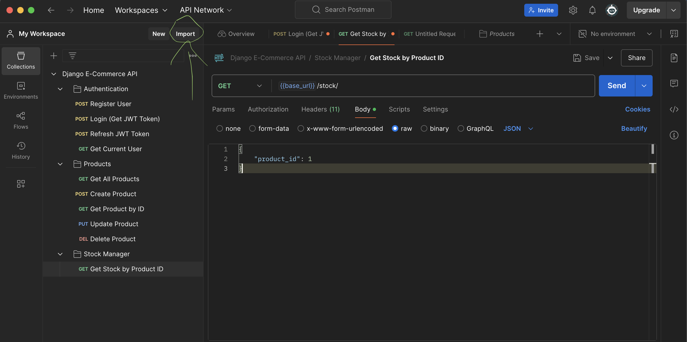

# CodingAnleitung: Stockmanager für Django E-Commerce Projekt

Diese Anleitung führt dich Schritt für Schritt durch die Implementierung eines Stockmanagers für das Django E-Commerce Projekt aus den H5P Lerneinheiten.

## 🎯 Voraussetzungen

Das **Vorlesungsprojekt aus den H5P Einheiten im E-Learning** muss vollständig funktionieren! Das bedeutet:

- Django Projekt läuft ohne Fehler
- Alle Apps (productmanager, shoppingcart, etc.) funktionieren
- Datenbank ist eingerichtet und migriert
- JWT-Authentifizierung ist konfiguriert
- Alle Dependencies sind installiert

**Wichtig**: Teste dein Basisprojekt zuerst, bevor du mit der Stockmanager-Implementierung beginnst!

## 📂 Schritt 1: Neue App "stockmanager" erstellen

Öffne das Terminal im Projektordner und stelle sicher, dass deine virtuelle Umgebung aktiviert ist:

```bash
# Virtuelle Umgebung aktivieren (falls nicht bereits aktiviert)
source venv/bin/activate  # Mac/Linux
# oder
venv\Scripts\activate     # Windows

# Neue App erstellen
python manage.py startapp stockmanager
```

## ⚙️ Schritt 2: App in settings.py hinzufügen

Öffne die Datei `learnig/settings.py` und füge die neue App zu `INSTALLED_APPS` hinzu:

```python
INSTALLED_APPS = [
    'django.contrib.admin',
    'django.contrib.auth',
    'django.contrib.contenttypes',
    'django.contrib.sessions',
    'django.contrib.messages',
    'django.contrib.staticfiles',

    'rest_framework',
    'djoser',
    'drf_yasg',
    'corsheaders',

    'shoppingcart',
    'adressmanager',
    'productmanager',
    'stockmanager',  # ← Neue App hier hinzufügen
    'shop',
    'cart'
]
```

## 🗃️ Schritt 3: Stock Model erstellen

Öffne die Datei `stockmanager/models.py` und erstelle das Stock Model:

```python
from django.db import models
from productmanager.models import Product

class Stock(models.Model):
    product = models.OneToOneField(Product, on_delete=models.CASCADE)
    forceInStock = models.BooleanField(default=False)
    currentStock = models.FloatField(default=0.0)
    lowestStock = models.FloatField(default=0.0)
    highestStock = models.FloatField(default=0.0)
    
    def __str__(self):
        return f"Stock for {self.product.product_name}"
```

## 🔄 Schritt 4: Migration erstellen und ausführen

Erstelle und führe die Datenbankmigrationen aus:

```bash
# Migration erstellen
python manage.py makemigrations stockmanager

# Migration ausführen
python manage.py migrate
```

Du solltest eine Ausgabe ähnlich dieser sehen:
```
Migrations for 'stockmanager':
  stockmanager/migrations/0001_initial.py
    - Create model Stock
```

## 📋 Schritt 5: Serializer erstellen

Erstelle eine neue Datei `stockmanager/serializers.py`:

```python
from rest_framework import serializers
from .models import Stock

class StockSerializer(serializers.Serializer):
    forceInStock = serializers.BooleanField()
    currentStock = serializers.FloatField()
    lowestStock = serializers.FloatField()
    highestStock = serializers.FloatField()

    def create(self, validated_data):
        return Stock.objects.create(**validated_data)

    def update(self, instance: Stock, validated_data):
        instance.forceInStock = validated_data.get("forceInStock", instance.forceInStock)
        instance.currentStock = validated_data.get("currentStock", instance.currentStock)
        instance.lowestStock = validated_data.get("lowestStock", instance.lowestStock)
        instance.highestStock = validated_data.get("highestStock", instance.highestStock)
        instance.save()
        return instance
```

## 🌐 Schritt 6: URLs konfigurieren

### Lokale URLs erstellen
Erstelle eine neue Datei `stockmanager/urls.py`:

```python
from django.urls import path
from stockmanager import views

urlpatterns = [
    path('', views.get_stock),
]
```

### Globale URLs erweitern
Öffne die Datei `learnig/urls.py` und füge die Stockmanager-URLs hinzu:

```python
urlpatterns = [
    path('api/swagger', schema_view.with_ui('swagger', cache_timeout=0),name='schema-swagger-ui'),
    path('admin/', admin.site.urls),

    path('auth/', include('djoser.urls')),
    path('auth/', include('djoser.urls.jwt')),

    path('customer/', include('shoppingcart.urls')),
    path('adresses/', include('adressmanager.urls')),
    path('products/', include('productmanager.urls')),
    path('stock/', include('stockmanager.urls')),  # ← Diese Zeile hinzufügen
    path('cart/', include('cart.urls')),
]
```

## 🔧 Schritt 7: View mit GET Route erstellen

Öffne die Datei `stockmanager/views.py` und implementiere die GET-Route:

```python
from rest_framework.decorators import api_view
from rest_framework.response import Response
from rest_framework import status
from .models import Stock
from .serializers import StockSerializer

@api_view(['GET'])
def get_stock(request):
    try:
        # Product ID aus dem Request Body holen
        product_id = request.data.get('product_id')
        
        if not product_id:
            return Response(
                {'error': 'product_id is required in request body'}, 
                status=status.HTTP_400_BAD_REQUEST
            )
        
        # Stock für das Produkt suchen
        stock = Stock.objects.get(product_id=product_id)
        
        # Serializer verwenden um nur die gewünschten Felder zurückzugeben
        serializer = StockSerializer(stock)
        
        return Response(serializer.data, status=status.HTTP_200_OK)
        
    except Stock.DoesNotExist:
        return Response(
            {'error': 'Stock not found for this product'}, 
            status=status.HTTP_404_NOT_FOUND
        )
    except Exception as e:
        return Response(
            {'error': str(e)}, 
            status=status.HTTP_500_INTERNAL_SERVER_ERROR
        )
```

## 📱 Schritt 8: Postman installieren und konfigurieren

### Postman herunterladen
1. Gehe zu [https://www.postman.com/downloads/](https://www.postman.com/downloads/)
2. Lade Postman für dein Betriebssystem herunter
3. Installiere und starte Postman

### API Collection importieren
1. Öffne Postman
2. Klicke auf **"Import"** (oben links)
3. Wähle **"Choose files"**
4. Navigiere zum `DOKUMENTATION` Ordner in diesem Repository
5. Wähle die Datei `PostmanApiSetup.json` aus
6. Klicke **"Import"**



## 👤 Schritt 9: Superuser erstellen

Erstelle einen Django Superuser für die Authentifizierung:

```bash
python manage.py createsuperuser
```

Folge den Anweisungen:
- **Username**: `admin` (oder beliebig)
- **Email**: `admin@example.com`
- **Password**: Sicheres Passwort eingeben

**Wichtig**: Merke dir diese Anmeldedaten!

## 🔑 Schritt 10: JWT Token in Postman holen

### Server starten
```bash
python manage.py runserver
```

**Wichtig**: Der Server muss während aller API-Anfragen laufen!

### In Postman authentifizieren
1. Öffne die importierte Collection "Django E-Commerce API"
2. Führe den Request **"Login (Get JWT Token)"** aus
3. Ändere den Request Body mit deinen Superuser-Daten:
   ```json
   {
       "username": "admin",
       "password": "dein_superuser_passwort"
   }
   ```
4. Klicke **"Send"**
5. Postman speichert den JWT Token automatisch in der Variable `{{jwt_token}}`

## 🗃️ Schritt 11: Testdaten in die Datenbank einfügen

Öffne dein Datenbankprogramm deiner Wahl:
- **TablePlus** (Mac/Windows)
- **SQLite Explorer**
- **DataGrip** (JetBrains)
- **DB Browser for SQLite**
- Oder ein anderes beliebiges Tool

### Datenbankverbindung
- **Datei**: `db.sqlite3` (im Projektordner)
- **Typ**: SQLite

### Stock-Datensatz einfügen
1. Öffne die Tabelle `stockmanager_stock`
2. Füge einen neuen Datensatz ein:
   ```sql
   INSERT INTO stockmanager_stock 
   (product_id, forceInStock, currentStock, lowestStock, highestStock) 
   VALUES (1, 0, 25.5, 5.0, 100.0);
   ```
3. Stelle sicher, dass `product_id = 1` einem existierenden Produkt entspricht

**Alternativ** kannst du auch das Django Admin Interface nutzen:
1. Gehe zu `http://127.0.0.1:8000/admin/`
2. Logge dich mit deinen Superuser-Daten ein
3. Erstelle einen Stock-Eintrag über die Weboberfläche

## 🧪 Schritt 12: Stock-Information über API abfragen

### In Postman testen
1. Stelle sicher, dass der Django Server läuft:
   ```bash
   python manage.py runserver
   ```

2. Öffne den Request **"Get Stock by Product ID"** in Postman

3. Der Request Body sollte so aussehen:
   ```json
   {
       "product_id": 1
   }
   ```

4. Klicke **"Send"**

### Erwartete Antwort
Bei erfolgreicher Ausführung solltest du folgende Response erhalten:

```json
{
    "forceInStock": false,
    "currentStock": 25.5,
    "lowestStock": 5.0,
    "highestStock": 100.0
}
```

## ✅ Erfolgskontrolle

Wenn du diese Response erhältst, hast du die Stockmanager-Implementierung erfolgreich abgeschlossen!

### Troubleshooting
- **401 Unauthorized**: JWT Token ist abgelaufen → Erneut einloggen
- **404 Not Found**: Kein Stock für diese product_id → Anderen Datensatz erstellen
- **500 Server Error**: Code-Fehler → Terminal-Output prüfen
- **Connection refused**: Django Server läuft nicht → `python manage.py runserver`

## 🎯 Zusammenfassung

Du hast erfolgreich:
1. ✅ Eine neue Django App "stockmanager" erstellt
2. ✅ Ein Stock Model mit OneToOneField-Relation implementiert
3. ✅ Einen Function-based View für GET /stock/ erstellt
4. ✅ JWT-Authentifizierung über Postman konfiguriert
5. ✅ Die API erfolgreich getestet

Deine Stockmanager-API ist jetzt bereit für den produktiven Einsatz!